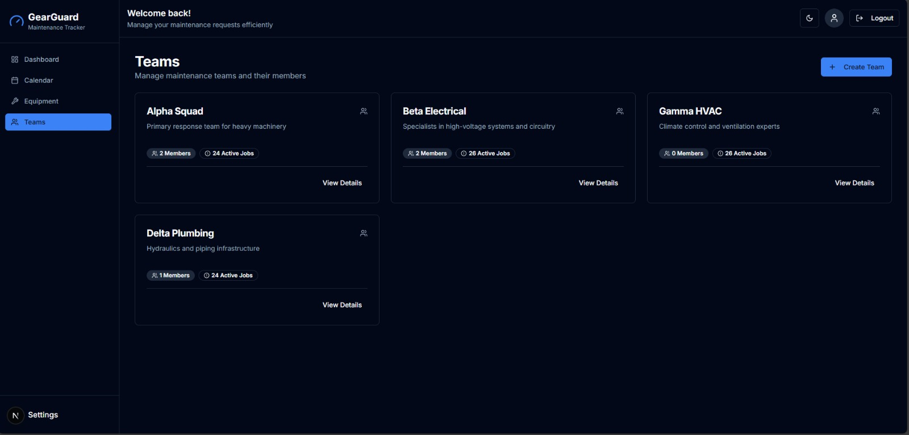
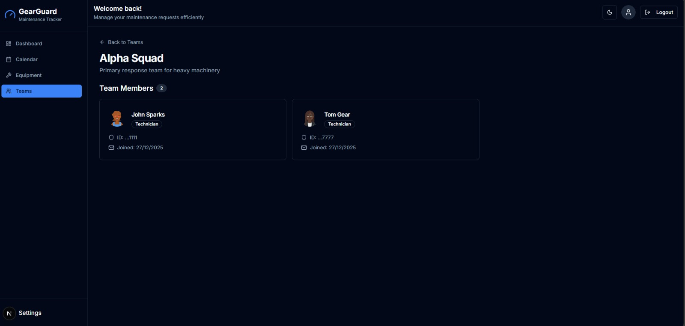
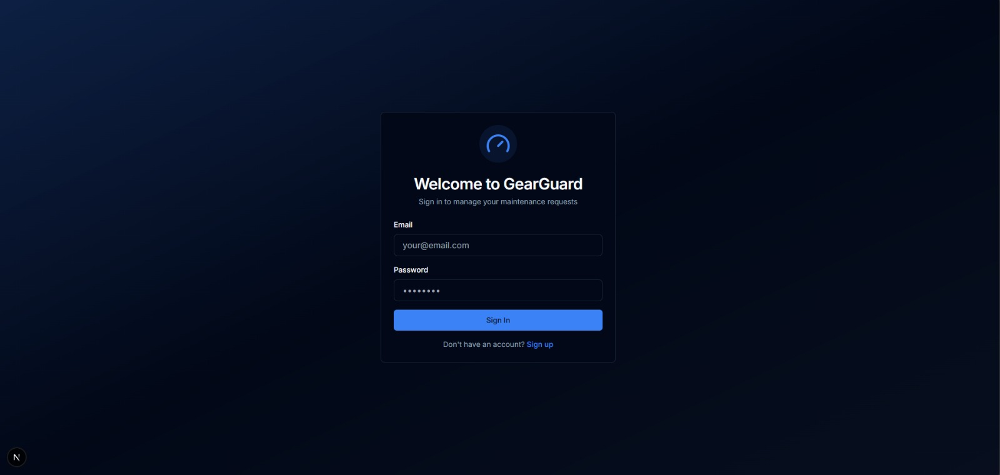
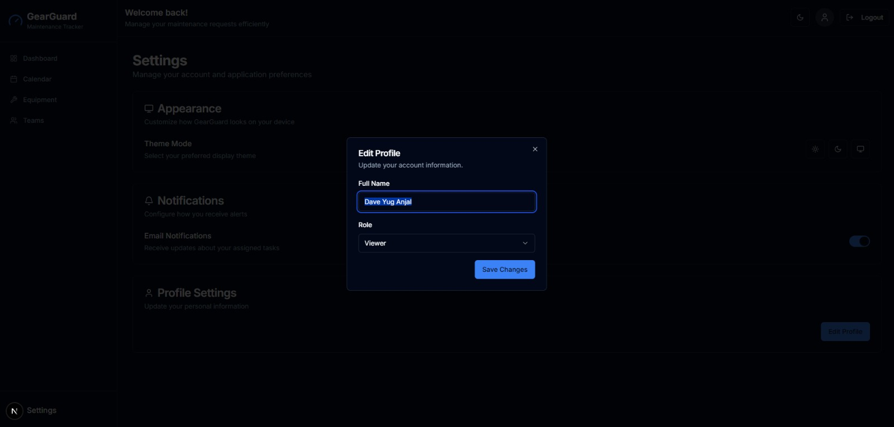
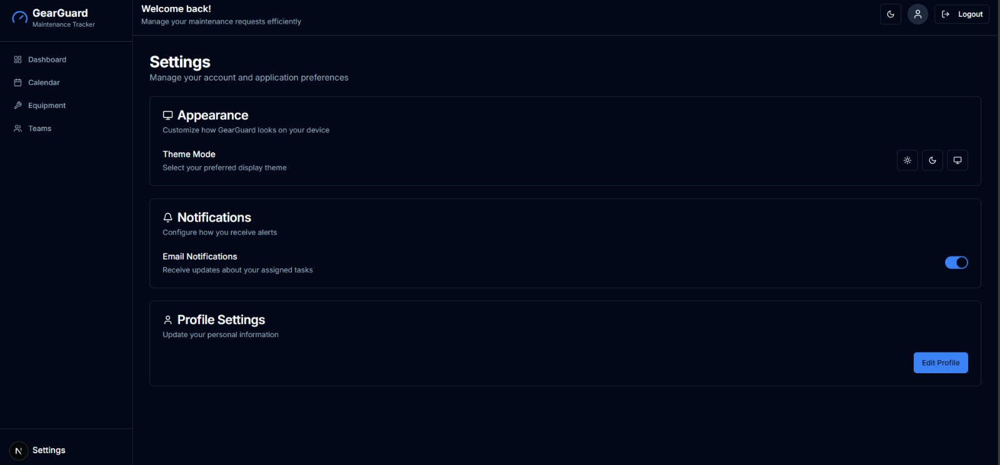

# 🛡️ GearGuard - The Ultimate Maintenance Tracker

> **Streamline your maintenance operations with power, precision, and ease.**


## 💡 The Idea

Maintenance management is often chaotic, relying on spreadsheets, paper forms, and fragmented communication. **GearGuard** changes the game by providing a **centralized, mobile-first platform** to track, schedule, and manage equipment maintenance.

Our goal is to **reduce downtime**, **extend equipment lifespan**, and **empower teams** with real-time visibility into their maintenance operations. Whether you are managing a small workshop or a large industrial floor, GearGuard keeps your gears turning.

---

## 🚀 How It Works

GearGuard connects your **Equipment**, **Teams**, and **Maintenance Requests** into a seamless workflow.


1.  **Asset Management**: Register all your equipment, complete with purchase details, warranty info, and images.
2.  **Team Organization**: Organize technicians into specialized maintenance teams (e.g., Electrical, Mechanical).
3.  **Request Lifecycle**:
    *   **Create**: Trigger maintenance requests manually or schedule preventive maintenance.
    *   **Assign**: Requests are auto-assigned to the correct team based on the equipment profile.
    *   **Track**: Use the **Kanban Board** to move requests from "New" → "In Progress" → "Repaired".
    *   **Resolve**: Complete requests, log outcomes, or mark equipment as "Scrap" if unrepairable.

---

## 📸 Features & Visual Tour

### 1. Interactive Dashboard
The heart of GearGuard. A powerful **Kanban Board** allows for drag-and-drop management of maintenance requests. Real-time updates utilize Supabase to keep everyone in sync.


### 2. Comprehensive Equipment Management
Keep a digital twin of your facility. Search, filter, and view the status of every piece of machinery.


**Detailed Insights**: Drill down into specific equipment to see its full history, assigned technicians, and specifications.


### 3. Smart Scheduling & Calendar
Never miss a preventive maintenance check. Our **Calendar View** gives you a monthly, weekly, and daily perspective of your maintenance load.

| Calendar Overview | Schedule Maintenance |
| :---: | :---: |
|  |  |

### 4. Team & User Management
Manage your workforce effectively. Create teams, assign roles, and track individual performance.

| Teams Overview | Team Details |
| :---: | :---: |
|  |  |

### 5. Seamless User Experience
From a secure **Login** to a personalized **Profile** and customizable **Settings**, every interaction is designed for clarity and speed.

| Login View | User Profile | Settings |
| :---: | :---: | :---: |
|  |  |  |

---

## 🛠️ Implementation & Tech Stack

GearGuard is built with a modern, type-safe stack designed for performance and scalability.

### Architecture
*   **Frontend**: Built with **Next.js 15 (App Router)** for server-side rendering and rapid page loads.
*   **Database**: **Supabase (PostgreSQL)** serves as the backbone, providing relational data storage and real-time subscriptions.
*   **Authentication**: Secure user management via **Supabase Auth**.
*   **Styling**: **Tailwind CSS** enables a bespoke, responsible design system that works on any device.

### Tech Stack Summary
| Category | Technology | Usage |
| :--- | :--- | :--- |
| **Framework** | Next.js 15 | Core application framework |
| **Language** | TypeScript | Type safety across the full stack |
| **Database** | Supabase | Postgres DB, Auth, Realtime |
| **State Mgmt** | TanStack Query | Server state synchronization |
| **UI Components** | Radix UI | Accessible component primitives |
| **Styling** | Tailwind CSS | Utility-first CSS |
| **Drag & Drop** | @hello-pangea/dnd | Kanban board interactions |
| **Calendar** | react-big-calendar | PM scheduling interface |

---

## ⚡ Deployment & Setup

### 1. Supabase Setup
1.  **Create Project**: Go to [supabase.com](https://supabase.com), create a new project.
2.  **Database Schema**:
    *   Run `supabase/schema.sql` in the SQL Editor to create tables.
    *   Run `supabase/rls-policies.sql` to secure your data.
3.  **Environment Variables**:
    *   Get your Project URL and Anon Key from Project Settings > API.
    *   Create `.env.local`:
        ```env
        NEXT_PUBLIC_SUPABASE_URL=your-project-url
        NEXT_PUBLIC_SUPABASE_ANON_KEY=your-anon-key
        ```

### 2. Run Locally
```bash
# Install dependencies
npm install

# Start development server
npm run dev
```
Visit **http://localhost:3000** to see GearGuard in action.

### 3. Seed Data (Optional)
To quickly populate your app with test data (Teams, Equipment, Requests):
1.  Open Supabase SQL Editor.
2.  Run the contents of `supabase/seed.sql`.

---

## 📂 Project Structure

```bash
gearguard/
├── app/                 # Next.js App Router pages
│   ├── (auth)/          # Authentication routes
│   ├── (dashboard)/     # Main app interface
│   └── globals.css      # Design tokens
├── components/          # Reusable UI components
│   ├── kanban/          # Board-specific logic
│   └── layout/          # Shell, Sidebar, Header
├── lib/
│   ├── supabase/        # Database client config
│   └── providers/       # React Context providers
└── supabase/            # SQL init scripts
```

---

<div align="center">

**Built for the Odoo x Adani Hackathon**

</div>
